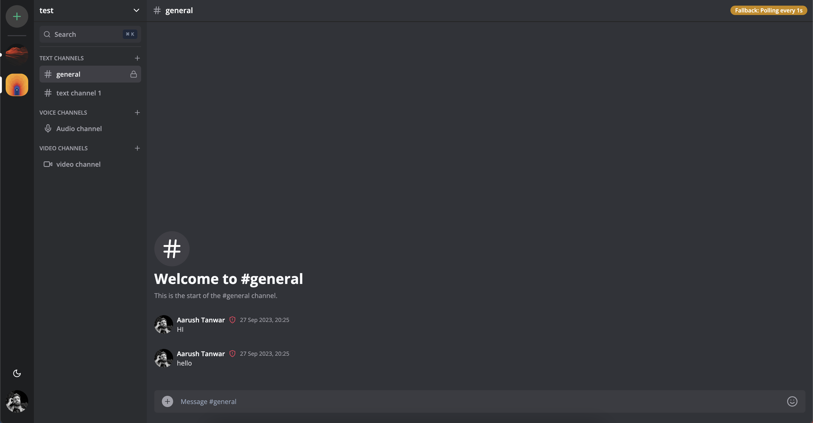
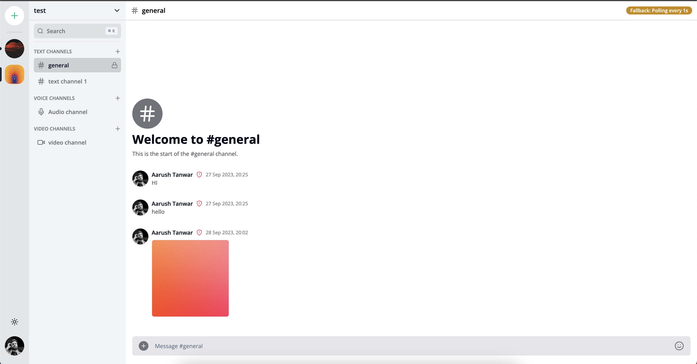
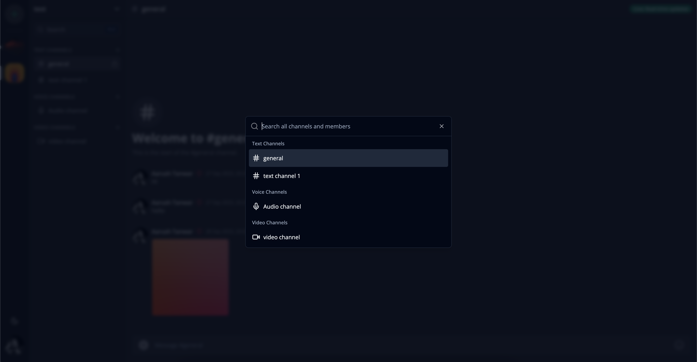
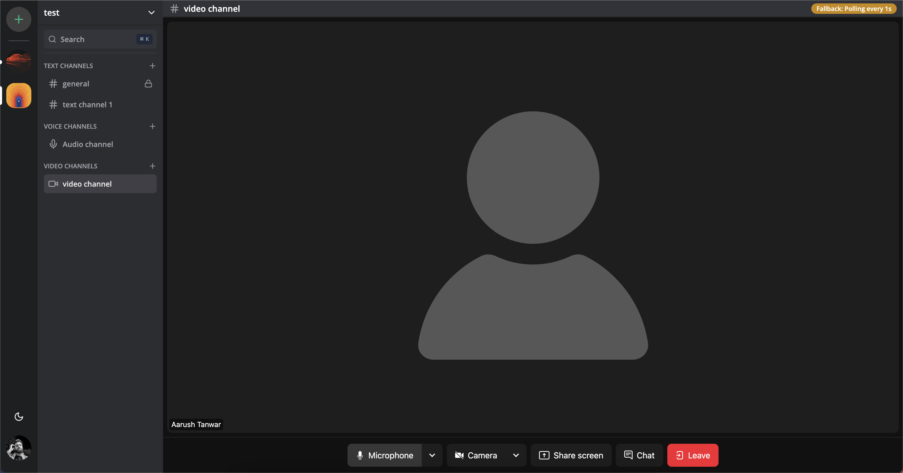
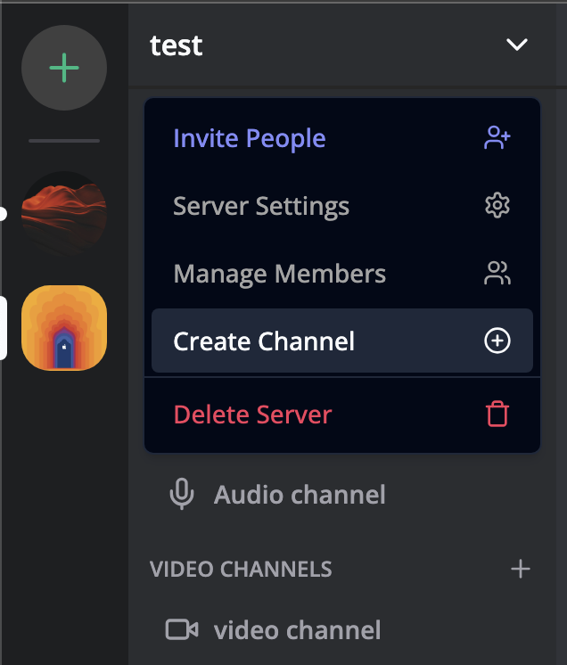

# Discoord | A Discord Clone

## Features

- Real-time messaging using Socket.io - Channels and DMs
- 1:1 conversation between members with screen sharing
- 1:1 video calls between members with screen sharing
- Send attachments as messages using UploadThing
- Delete & Edit messages in real time for all users
- Create Text, Audio and Video call Channels
- Member management (Kick, Role change Guest / Moderator)
- Unique invite link generation & full working invite system
- Infinite loading for messages in batches of 10 (tanstack/query)
- Server creation and customization
- Beautiful UI using TailwindCSS and ShadcnUI
- Full responsivity and mobile UI
- Websocket fallback: Polling with alerts
- Authentication with Clerk
- MySQL database using Planetscale
- ORM using Prisma
- Light / Dark mode

## Screenshots

### Channels - Text, Audio, Video





### Search



### Calling - Audio and Video with Screen Sharing



### More Features



## Prerequisites

### Rename `.env.example` to `.env.local`

```js
NEXT_PUBLIC_CLERK_PUBLISHABLE_KEY=
CLERK_SECRET_KEY=
NEXT_PUBLIC_CLERK_SIGN_IN_URL=/sign-in
NEXT_PUBLIC_CLERK_SIGN_UP_URL=/sign-up
NEXT_PUBLIC_CLERK_AFTER_SIGN_IN_URL=/
NEXT_PUBLIC_CLERK_AFTER_SIGN_UP_URL=/
DATABASE_URL=
UPLOADTHING_SECRET=
UPLOADTHING_APP_ID=
LIVEKIT_API_KEY=
LIVEKIT_API_SECRET=
NEXT_PUBLIC_LIVEKIT_URL=
NEXT_PUBLIC_SITE_URL=
```

### Setup prisma for Planetscale mySQL database

```shell
npx prisma generate
npx prisma db push
```

## Start the App

```bash
npm run dev
# or
yarn dev
# or
pnpm dev
# or
bun dev
```
